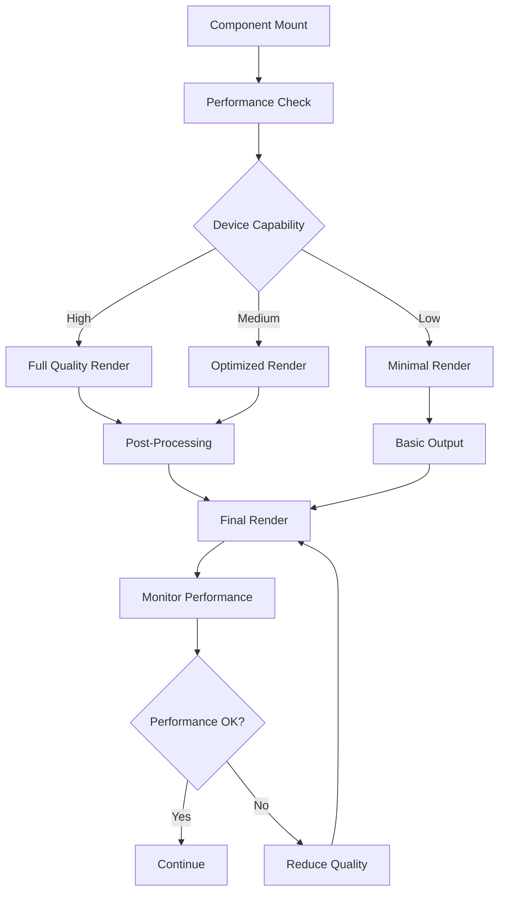
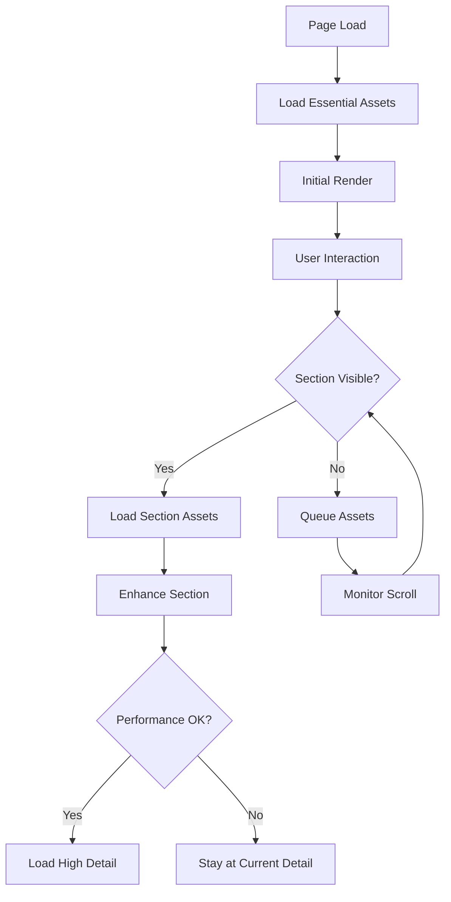
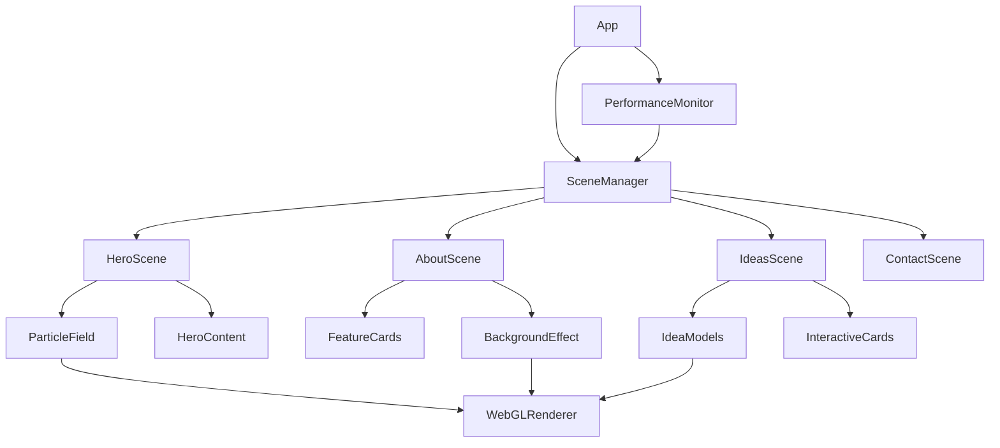

# Design Document: Enhanced 3D Experience

## Overview

This design document outlines the approach for implementing enhanced 3D backgrounds and animations throughout The Bridger website. The goal is to create a visually stunning and immersive experience that reinforces the innovative nature of the project while maintaining performance and accessibility. The enhanced 3D experience will be implemented across key sections of the website, with each section featuring unique but cohesive visual elements.

## Architecture

The enhanced 3D experience will be built using the following technologies:

1. **Three.js/React Three Fiber**: We'll continue using React Three Fiber as the primary 3D rendering library, leveraging its integration with React's component model.

2. **Drei**: We'll expand our use of Drei helpers to implement more advanced 3D effects and optimizations.

3. **GLSL Shaders**: Custom shaders will be implemented for more sophisticated visual effects, particularly for background animations.

4. **Performance Monitoring**: We'll implement a performance monitoring system that can dynamically adjust the complexity of 3D scenes based on device capabilities.

5. **Asset Management**: A structured approach to 3D asset loading, including progressive loading and LOD (Level of Detail) implementations.

The architecture will follow these principles:

- **Component-Based**: Each 3D element will be encapsulated in reusable React components
- **Progressive Enhancement**: Core functionality works without 3D, with 3D elements added as progressive enhancement
- **Responsive Design**: 3D elements adapt to different screen sizes and device capabilities
- **Performance-First**: Optimization techniques applied throughout to ensure smooth performance

## Components and Interfaces

### 1. Enhanced Particle Field System

```typescript
interface ParticleFieldProps {
  count: number;
  colors: {
    primary: string;
    secondary: string;
  };
  size: number;
  speed: number;
  interactivity: 'none' | 'hover' | 'scroll';
  complexity: 'low' | 'medium' | 'high';
}
```

The enhanced ParticleField will support:
- Variable particle counts based on device performance
- Custom color schemes that match the section theme
- Different interaction modes (none, hover response, scroll response)
- Complexity levels that can be dynamically adjusted

### 2. Section Background Manager

```typescript
interface SectionBackgroundProps {
  type: 'particles' | 'waves' | 'terrain' | 'custom';
  theme: 'hero' | 'about' | 'ideas' | 'contact';
  intensity: number;
  scrollFactor: number;
  colorScheme: ColorScheme;
}

interface ColorScheme {
  primary: string;
  secondary: string;
  accent: string;
}
```

This component will manage different background types for each section, handling:
- Scroll-based transitions between background styles
- Theme-specific color schemes and animations
- Intensity adjustments based on performance metrics

### 3. Interactive 3D Models

```typescript
interface InteractiveModelProps {
  modelPath: string;
  fallbackImage: string;
  animations: Animation[];
  interactionType: 'hover' | 'click' | 'auto';
  complexity: 'low' | 'medium' | 'high';
  sector: 'education' | 'agriculture' | 'healthcare' | 'transport';
}

interface Animation {
  name: string;
  trigger: 'hover' | 'click' | 'visible' | 'loop';
  duration: number;
}
```

These components will:
- Load appropriate 3D models for each sector
- Manage interactions and animations
- Provide fallback options for devices that can't handle complex 3D

### 4. Performance Monitor

```typescript
interface PerformanceConfig {
  targetFrameRate: number;
  complexityLevels: {
    high: { particleCount: number, effectsEnabled: string[] },
    medium: { particleCount: number, effectsEnabled: string[] },
    low: { particleCount: number, effectsEnabled: string[] },
  };
  adaptationSpeed: 'immediate' | 'gradual';
}
```

This utility will:
- Monitor frame rates and other performance metrics
- Dynamically adjust scene complexity
- Store user preferences for visual quality

### 5. Accessibility Wrapper

```typescript
interface A11yWrapperProps {
  ariaLabel: string;
  alternativeText: string;
  motionReduced: boolean;
  children: React.ReactNode;
}
```

This component will:
- Provide appropriate ARIA attributes for 3D elements
- Implement alternative experiences for users with reduced motion preferences
- Ensure keyboard navigability for interactive elements

## Data Models

### Performance Metrics

```typescript
interface PerformanceMetrics {
  fps: number;
  lastUpdated: number;
  averageFps: number;
  deviceTier: 'low' | 'medium' | 'high';
  memoryUsage?: number;
  throttling: boolean;
}
```

### User Preferences

```typescript
interface UserPreferences {
  qualityPreference: 'auto' | 'low' | 'medium' | 'high';
  motionReduced: boolean;
  hasInteracted: boolean;
}
```

### 3D Asset Registry

```typescript
interface Asset3D {
  id: string;
  path: string;
  type: 'model' | 'texture' | 'shader';
  size: number;
  lodLevels?: string[];
  preload: boolean;
}

interface AssetRegistry {
  assets: Asset3D[];
  loaded: string[];
  failed: string[];
  priorityQueue: string[];
}
```

## Error Handling

1. **Asset Loading Failures**:
   - Implement fallback mechanisms for failed 3D asset loads
   - Use placeholder geometries or simplified versions when models fail to load
   - Log detailed error information for debugging

2. **Performance Degradation**:
   - Monitor frame rate drops and implement automatic quality reduction
   - Provide user feedback when quality is automatically reduced
   - Allow users to manually adjust quality settings

3. **WebGL Support Issues**:
   - Detect WebGL support at startup
   - Provide graceful fallbacks for browsers with limited or no WebGL support
   - Use CSS-based animations as ultimate fallback

4. **Memory Management**:
   - Implement proper disposal of 3D objects when components unmount
   - Monitor memory usage and implement cleanup when thresholds are reached
   - Use texture compression and geometry simplification for memory optimization

## Testing Strategy

### Performance Testing

- Benchmark frame rates across different device tiers
- Measure load times for 3D assets
- Test memory usage patterns during extended sessions
- Verify automatic quality adjustments work as expected

### Visual Testing

- Compare renders across different browsers and devices
- Verify animations and transitions appear as designed
- Ensure color schemes and themes are consistent
- Test with different screen sizes and aspect ratios

### Accessibility Testing

- Verify screen reader compatibility
- Test with motion reduction preferences enabled
- Ensure keyboard navigation works for all interactive elements
- Verify sufficient contrast ratios in all visual states

### Browser Compatibility

- Test across major browsers (Chrome, Firefox, Safari, Edge)
- Verify fallbacks work on browsers with limited WebGL support
- Test on both desktop and mobile browsers

## Technical Diagrams

### 3D Rendering Pipeline



### Asset Loading Strategy



### Component Interaction



## Implementation Considerations

### Mobile Optimization

- Implement touch-friendly interactions for 3D elements
- Reduce particle counts and effect complexity on mobile devices
- Use device orientation as an optional interaction method
- Ensure 3D elements don't cause layout shifts on mobile

### Performance Budgets

- Target 60fps on high-end devices
- Maintain at least 30fps on mid-range devices
- Limit initial load of 3D assets to under 5MB
- Ensure Time to Interactive is not delayed by more than 1s due to 3D elements

### Progressive Enhancement

- Implement core functionality without reliance on 3D effects
- Load 3D elements after critical content is displayed
- Provide CSS-based alternatives for all animations
- Ensure all information is accessible without 3D rendering

### Shader Optimizations

- Use instancing for repeated geometries
- Implement shader LOD (Level of Detail) systems
- Optimize fragment shaders for mobile GPUs
- Use compute shaders where appropriate for particle systems